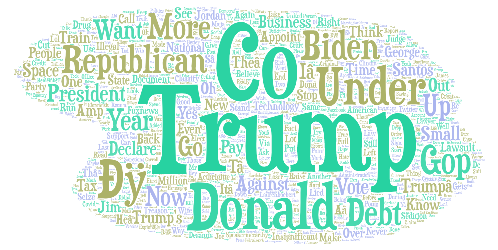

I chose this topic because I was curious what words were used when Trump and Bidens name is discussed. The word Co is brought up heavily with both names and both involve each others names very often. Biden a little more than Trump to my surprise. The reasons for why some of these words are associated with each other is because both men seem to critisize each other and mention them by name. I think my search could be iproved in the futrure if I limit the number of words allowed in the word cloud. What I thought was interesting is that Co was used more than biden which went against my expectations for what I would find when looking for words assosiated with Biden.

